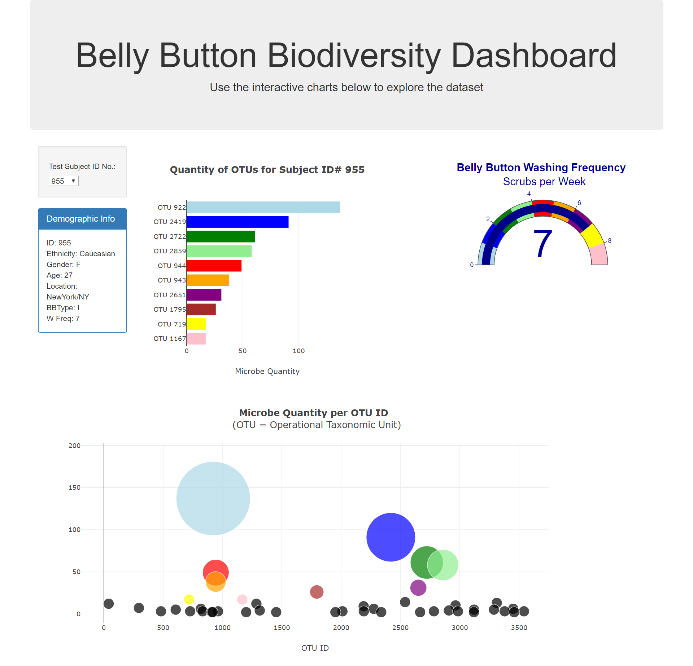

# plotly-challenge
This repo uses Javascript, plotly, and d3 to create a dashboard of data for a selected test subject.
The data is located in samples.json from the Belly Button Diversity project.

About the Data:
Hulcr, J. et al.(2012) A Jungle in There: Bacteria in Belly Buttons are Highly Diverse, but Predictable. 
Retrieved from: http://robdunnlab.com/projects/belly-button-biodiversity/results-and-data/

Here is what the dashboard looks like:

